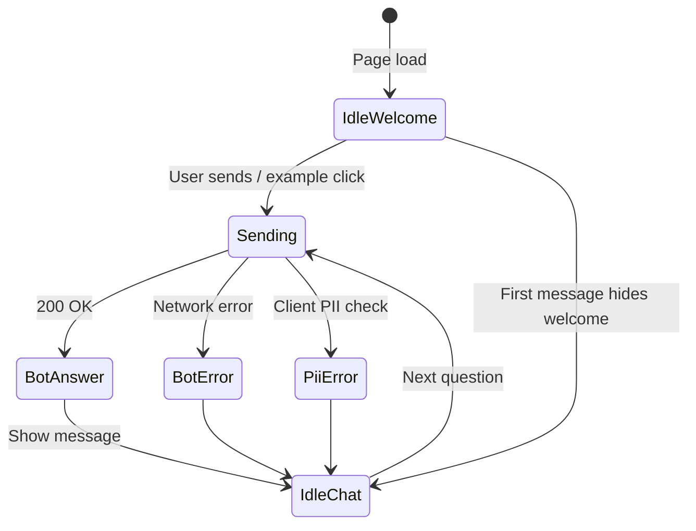

# Screen design — Mutual Fund FAQ Assistant (Phase 4)

Design specification for the single-page chat UI. Use this document to capture layout, visual tokens, and component behavior before or while updating `index.html`, `css/styles.css`, and `js/app.js`.

**Reference:** [PhaseWiseArchitecture.md](../../PhaseWiseArchitecture.md) §4 · [Problemstatement.md](../../Problemstatement.md)

---

## 1. Product context

| Item | Value |
|------|--------|
| App name | Mutual Fund FAQ Assistant |
| Scope | Facts-only Q&A for **5 AMC overview pages** (Choice, Unifi, Union, ICICI Prudential, LIC) |
| Backend | `POST /query` on same origin (served by `phase3.run_server` at `/`) |
| Tone | Trustworthy Indian fintech (Groww-adjacent), minimal, compliance-first — **not** a trading app |
| Hard rule | **Facts-only. No investment advice.** No PII collection |

---

## 2. Screen inventory

One primary screen: **Chat home** (no routing, no login).

| Screen | Route | Purpose |
|--------|-------|---------|
| Chat home | `/` | Welcome, examples, conversation, composer |

Future screens (out of scope unless you add them):

| Screen | Notes |
|--------|--------|
| About / corpus | Optional static page listing the five source URLs |
| Error / offline | Could replace generic fetch error in `app.js` |

---

## 3. Layout wireframe

Mobile-first; max content width **820px**, centered.

```text
┌─────────────────────────────────────────────────────────────┐
│ HEADER (sticky)                                             │
│  ┌ Title + tagline ──────────────────────────────────────┐  │
│  │ Mutual Fund FAQ Assistant                               │  │
│  │ Factual answers from five official AMC overview pages.  │  │
│  └─────────────────────────────────────────────────────────┘  │
│  ┌ DISCLAIMER BANNER ─────────────────────────────────────┐  │
│  │ Facts-only. No investment advice.                       │  │
│  └─────────────────────────────────────────────────────────┘  │
├─────────────────────────────────────────────────────────────┤
│ MAIN (scroll)                                               │
│                                                             │
│  [Welcome block — hidden after first message]               │
│    · Welcome copy                                           │
│    · “How citations work” callout                           │
│    · 3 example question chips/buttons                       │
│                                                             │
│  [Chat transcript]                                          │
│    User bubble (right)                                      │
│    Bot bubble (left) + optional meta (source, footer, link) │
│                                                             │
├─────────────────────────────────────────────────────────────┤
│ FOOTER / COMPOSER (sticky bottom)                           │
│  [ textarea ]                              [ Send ]         │
│  Privacy note: no PAN, Aadhaar, …                           │
└─────────────────────────────────────────────────────────────┘
```

### Region → DOM mapping

| Region | Element / ID | CSS hook |
|--------|----------------|----------|
| App shell | `.app` | Flex column, `min-height: 100vh` |
| Header | `header.header` | Sticky top, white surface |
| Title block | `.header-inner` | `h1`, `.tagline` |
| Disclaimer | `aside.disclaimer` | Warning-style banner |
| Welcome | `#welcome.welcome` | Hidden via `hidden` after first send |
| Chat | `#chat.chat` | Message list |
| Composer | `#composer` in `footer.composer-wrap` | Sticky bottom |
| Input | `#query-input` | Textarea, max 2000 chars |
| Send | `#send-btn` | Submit |

---

## 4. Visual design tokens

**Current implementation** lives in `:root` in `css/styles.css`. Replace or extend below when you apply a new design system.

```css
/* === PASTE / OVERRIDE DESIGN TOKENS HERE === */

:root {
  /* Surfaces */
  --bg:           #f4f6f8;   /* page background */
  --surface:      #ffffff;   /* cards, header, bot bubbles */
  --border:       #d8dee6;

  /* Typography */
  --text:         #1a2332;
  --muted:        #5c6778;
  --font:         "Segoe UI", system-ui, -apple-system, sans-serif;

  /* Brand / accent (Groww-like teal — adjust to match Stitch export) */
  --accent:       #0d5c63;
  --accent-soft:  #e6f3f4;
  --link:         #0d5c63;

  /* Chat bubbles */
  --user-bg:      #eef2ff;
  --bot-bg:       #ffffff;

  /* Semantic */
  --warning-bg:   #fff8e6;
  --warning-text: #7a5b00;
  --error-bg:     #fdecea;
  --error-text:   #9b1c1c;

  /* Layout */
  --radius:       12px;
  --shadow:       0 1px 3px rgba(26, 35, 50, 0.08);
  --max-width:    820px;
}

/* === END TOKENS === */
```

### Typography scale (suggested)

| Role | Size | Weight | Element |
|------|------|--------|---------|
| App title | 1.25rem | 650 | `h1` |
| Tagline | 0.9rem | 400 | `.tagline` |
| Section heading | 1.05rem | 600 | `.welcome h2` |
| Body | 1rem | 400 | `p`, `.message-text` |
| Meta / footer | 0.8125rem | 400 | `.message-meta`, `.privacy-note` |
| Disclaimer | 0.875rem | 600 | `.disclaimer` |

### Spacing (suggested)

| Token | Value | Usage |
|-------|-------|--------|
| `--space-xs` | 0.25rem | Tight gaps |
| `--space-sm` | 0.5rem | Example buttons gap |
| `--space-md` | 1rem | Main padding |
| `--space-lg` | 1.25rem | Header / section padding |
| `--space-xl` | 1.5rem | Section separation |

---

## 5. Components

### 5.1 Disclaimer banner

- **Copy (required):** `Facts-only. No investment advice.`
- **Placement:** Below title in sticky header; always visible on load.
- **Style:** Distinct from body (warning tint); must not look like a dismissible toast.
- **HTML slot:** `aside.disclaimer`

### 5.2 Welcome panel

Shown until the user sends the first message (`#welcome` → `hidden = true` in `app.js`).

| Block | Content |
|-------|---------|
| Heading | Welcome |
| Body | Short explanation of corpus + citations |
| Callout | “How citations work” (accent-soft background) |
| Examples | Exactly **3** neutral factual prompts |

**Example questions (current):**

1. What is the AUM of Unifi Mutual Fund?
2. What is the minimum SIP for Unifi Liquid Fund?
3. What is the expense ratio for Union Small Cap Fund?

Use **named schemes** for per-fund metrics; AMC-wide metric questions may correctly return “no information.”

**HTML slot:** `.example-btn` with `data-query="…"`.

### 5.3 Example question chip

- Looks like tappable cards/chips, not primary CTAs.
- Full question text visible; left-aligned.
- Hover/focus: accent border + soft fill.
- **Behavior:** Fills input and submits (see `app.js`).

### 5.4 Chat message — user

| Property | Spec |
|----------|------|
| Class | `.message.user` |
| Align | End (right) |
| Background | `--user-bg` |
| Content | Plain text only (escaped) |

### 5.5 Chat message — bot

| Property | Spec |
|----------|------|
| Class | `.message.bot` |
| Align | Start (left) |
| Body | `data.response` |
| Meta | Optional `.message-meta` below divider |

**Bot meta rows (from API):**

| Field | Label in UI | When shown |
|-------|-------------|------------|
| `citation` | **Source:** link | Grounded factual answer |
| `footer` | As returned (e.g. “Last updated from sources: YYYY-MM-DD”) | When API sends it |
| `educational_link` | **Learn more:** link | Advisory/comparison refusals |

Do **not** show a source link when `response_type` is `no_information` or refusals without corpus citation.

### 5.6 Chat message — error

| Trigger | Class | Copy |
|---------|-------|------|
| PII detected client-side | `.message.bot.error` | Privacy message (see `app.js`) |
| Network / 5xx | `.message.bot.error` | Generic retry message |
| Query too long | `.message.bot.error` | Length limit message |

### 5.7 Typing indicator

- Shown while `fetch('/query')` is in flight.
- Class: `.message.bot` + `.typing` on `.message-text`.
- Copy: `Thinking…`
- Replace entire node with final bot message on success.

### 5.8 Composer

| Control | Spec |
|---------|------|
| Textarea | 2 rows default; Enter sends, Shift+Enter newline |
| Max length | 2000 characters |
| Placeholder | Neutral factual prompt hint |
| Send button | Primary accent; disabled while request pending |
| Privacy note | Below form; no PII reminder |

**No inputs for:** name, email, phone, PAN, account ID, OTP.

---

## 6. API contract (UI rendering)

**Request:** `POST /query`

```json
{ "query": "What is the NAV of Union Small Cap Fund?" }
```

**Response fields used by UI:**

```json
{
  "response": "The NAV of Union Small Cap Fund is 59.89.",
  "citation": "https://groww.in/mutual-funds/amc/union-mutual-funds",
  "footer": "Last updated from sources: 2026-06-06",
  "educational_link": "",
  "response_type": "answer_with_citation",
  "intent": "factual",
  "confidence": 0.6,
  "has_citation": true,
  "has_grounded_answer": true
}
```

### `response_type` → UI treatment

| `response_type` | Citation | Educational link | Notes |
|-----------------|----------|------------------|-------|
| `answer_with_citation` | Show if non-empty | Hide | Normal grounded answer |
| `answer_no_citation` | Hide | Hide | Rare; answer text only |
| `no_information` | Hide | Hide | Polite “don’t have information” |
| `refusal_advisory` | Hide | Show | No advice |
| `refusal_comparison` | Hide | Show | No fund comparisons |
| `refusal_personal_info` | Hide | Hide | Account-style queries |

Rendering logic: `phase4/ui/js/app.js` → `renderBotResponse(data)`.

---

## 7. States & flows



| State | Welcome visible | Composer |
|-------|-----------------|----------|
| Initial | Yes | Enabled |
| Loading | Hidden after first send | Disabled |
| Chat active | No | Enabled |

---

## 8. Responsive behavior

| Breakpoint | Behavior |
|------------|----------|
| &lt; 480px | Full-width padding; example buttons stack; composer full bleed |
| 480–820px | Centered column, side padding |
| &gt; 820px | `.app` max-width 820px; extra margin auto |

Header and composer stay **sticky** on all sizes so disclaimer and input remain reachable.

---

## 9. Accessibility

- Landmarks: `banner`, `main`, `contentinfo`
- Chat: `aria-live="polite"` on `#chat`
- Example group: `aria-label="Example questions"`
- Composer: visible label via `.sr-only` for `#query-input`
- Focus rings on buttons and links (`:focus-visible`)
- Color contrast: disclaimer and error states must meet WCAG AA against chosen tokens

---

## 10. Where to put design code

| What you're adding | File |
|--------------------|------|
| Design tokens, layout, components | `css/styles.css` |
| Structure, copy, landmarks | `index.html` |
| Fetch, PII check, message render | `js/app.js` |
| Fonts, icons, images | `phase4/ui/assets/` (create as needed) |
| Stitch / Figma export notes | Section 11 below |

After changing static files, restart or refresh `python3 -m phase3.run_server` — UI is served from `phase4/ui/` at `/`.

---

## 11. Design export checklist (Stitch / Figma)

---
name: Mutual Fund FAQs
colors:
  surface: '#fcf9f8'
  surface-dim: '#dcd9d9'
  surface-bright: '#fcf9f8'
  surface-container-lowest: '#ffffff'
  surface-container-low: '#f6f3f2'
  surface-container: '#f0eded'
  surface-container-high: '#eae7e7'
  surface-container-highest: '#e5e2e1'
  on-surface: '#1c1b1b'
  on-surface-variant: '#3c4a43'
  inverse-surface: '#313030'
  inverse-on-surface: '#f3f0ef'
  outline: '#6b7b72'
  outline-variant: '#bacac1'
  surface-tint: '#006c4f'
  primary: '#006c4f'
  on-primary: '#ffffff'
  primary-container: '#00d09c'
  on-primary-container: '#00533c'
  inverse-primary: '#2fe0aa'
  secondary: '#0058bc'
  on-secondary: '#ffffff'
  secondary-container: '#0070eb'
  on-secondary-container: '#fefcff'
  tertiary: '#934b07'
  on-tertiary: '#ffffff'
  tertiary-container: '#ffa15b'
  on-tertiary-container: '#733800'
  error: '#ba1a1a'
  on-error: '#ffffff'
  error-container: '#ffdad6'
  on-error-container: '#93000a'
  primary-fixed: '#59fdc5'
  primary-fixed-dim: '#2fe0aa'
  on-primary-fixed: '#002116'
  on-primary-fixed-variant: '#00513b'
  secondary-fixed: '#d8e2ff'
  secondary-fixed-dim: '#adc6ff'
  on-secondary-fixed: '#001a41'
  on-secondary-fixed-variant: '#004493'
  tertiary-fixed: '#ffdcc6'
  tertiary-fixed-dim: '#ffb785'
  on-tertiary-fixed: '#301400'
  on-tertiary-fixed-variant: '#713700'
  background: '#fcf9f8'
  on-background: '#1c1b1b'
  surface-variant: '#e5e2e1'
typography:
  display-sm:
    fontFamily: Inter
    fontSize: 24px
    fontWeight: '600'
    lineHeight: 32px
    letterSpacing: -0.02em
  headline-md:
    fontFamily: Inter
    fontSize: 18px
    fontWeight: '600'
    lineHeight: 24px
    letterSpacing: -0.01em
  body-lg:
    fontFamily: Inter
    fontSize: 16px
    fontWeight: '400'
    lineHeight: 24px
  body-md:
    fontFamily: Inter
    fontSize: 14px
    fontWeight: '400'
    lineHeight: 20px
  label-md:
    fontFamily: Inter
    fontSize: 12px
    fontWeight: '500'
    lineHeight: 16px
    letterSpacing: 0.01em
  headline-md-mobile:
    fontFamily: Inter
    fontSize: 16px
    fontWeight: '600'
    lineHeight: 22px
rounded:
  sm: 0.25rem
  DEFAULT: 0.5rem
  md: 0.75rem
  lg: 1rem
  xl: 1.5rem
  full: 9999px
spacing:
  container-max: 800px
  stack-gap: 1rem
  section-padding: 1.5rem
  inline-gutter: 1rem
  mobile-margin: 1rem
---

## Brand & Style

The design system is centered on **Institutional Minimalism**. It targets Indian mutual fund investors seeking clarity, safety, and factual accuracy. The visual narrative avoids the "gamified" tropes of modern trading apps, instead leaning into a clean, systematic aesthetic that evokes the stability of a financial institution with the accessibility of modern technology.

The emotional response is one of **calculated calm**. By utilizing generous white space (Airy Spacing) and a restrained palette, the interface prioritizes readability and cognitive ease. The style is "Corporate Modern," characterized by subtle borders, high-quality typography, and a lack of aggressive marketing elements.

## Colors

The palette is optimized for clarity and financial trust. 
- **Primary Green (#00D09C)** is reserved strictly for successful states and primary actions (CTAs), symbolizing growth and "Go" signals.
- **Background (#F6F7FB)** provides a soft, cool canvas that reduces eye strain compared to pure white, while **Surface (#FFFFFF)** is used to elevate interactive cards.
- **User Bubbles (#EEF2FF)** use a soft indigo tint to distinguish user input from the assistant’s white-backed authoritative responses.
- **Disclaimers** utilize a specific muted amber pairing (#FFF8E6 / #7A5B00) to ensure regulatory information is visible but not alarming.

## Typography

The typography system uses **Inter** exclusively to maintain a systematic, utilitarian feel. 
- **Readability:** Body copy uses a 1.5x line-height ratio to ensure financial jargon is easy to parse.
- **Hierarchy:** Headlines use a semi-bold weight (600) with slight negative letter spacing to feel "tight" and professional.
- **Labels:** Small labels and captions use medium weight (500) to maintain legibility at 12px.
- **Scaling:** On mobile devices, the headline sizes should scale down by roughly 10-15% to maintain information density without feeling cramped.

## Layout & Spacing

This design system uses a **Fixed Grid** approach for the chat container to maintain focus, centered within the viewport.
- **The Chat Column:** Capped at 800px on desktop to ensure optimal line lengths for reading.
- **Airy Rhythm:** A 4px base-unit is used, but the primary vertical rhythm is 16px (1rem) for message stacking and 24px (1.5rem) for section grouping.
- **Mobile Reflow:** On devices under 640px, the 24px margins compress to 16px, and the message bubbles span the full width of the container minus the gutter.

## Elevation & Depth

Hierarchy is established through **Tonal Layers** and **Low-Contrast Outlines** rather than heavy shadows.
- **Base Level:** The background (#F6F7FB) is the lowest z-index.
- **Surface Level:** Chat bubbles and cards sit on the base, using a 1px solid border (#E5E7EB).
- **Active Elevation:** Only the primary input area and floating action buttons may use a very soft ambient shadow (0px 4px 12px, 5% opacity black) to suggest interactivity.
- **Depth through Color:** Depth is implied by the contrast between the white assistant bubbles and the indigo-tinted user bubbles.

## Shapes

The shape language is consistently **Rounded** (12px/0.75rem).
- **Message Bubbles:** Use the 12px radius on all corners, except for the "tail" corner (the corner closest to the avatar) which can be reduced to 4px to indicate directionality.
- **Cards and Containers:** Use a uniform 12px radius.
- **Buttons:** Follow the 12px standard unless they are "Pill" style for secondary tags/chips.

## Components

### Buttons & Chips
- **Primary CTA:** Solid #00D09C background with #FFFFFF text. No gradients. 12px roundedness.
- **Ghost Chips:** Used for "Suggested Questions." #FFFFFF background, #E5E7EB border, #1A1A1A text. Hover state: Light gray background tint.

### Chat Bubbles
- **Assistant:** #FFFFFF background, 1px border #E5E7EB, #1A1A1A text. Aligned left.
- **User:** #EEF2FF background, no border, #1A1A1A text. Aligned right.

### Input Fields
- **Chat Input:** A prominent #FFFFFF bar with 12px roundedness. Use a 1px #E5E7EB border that transitions to #00D09C on focus. Text should be #1A1A1A with #6B7280 placeholder.

### Cards & Disclaimers
- **FAQ Card:** White background, 1px border. Inside, use #6B7280 for secondary details (e.g., "Source: SEBI").
- **Regulatory Disclaimer:** A full-width block with #FFF8E6 background and #7A5B00 text. Placed either at the very top of the chat or as a footer.

### Lists
- Use simple bullet points with 8px indentation. Avoid icons in lists to maintain the "Factual/Institutional" tone.

## 12. Copy deck (editable)

| Key | Copy |
|-----|------|
| `title` | Mutual Fund FAQ Assistant |
| `tagline` | Factual answers from five official AMC overview pages. |
| `disclaimer` | Facts-only. No investment advice. |
| `welcome_heading` | Welcome |
| `welcome_body` | Ask objective questions about mutual fund schemes covered in our corpus. Answers are grounded in public AMC pages and include a source link when information is available. |
| `citations_help` | **How citations work:** When we find a grounded answer, you will see exactly one link to the source page and a “Last updated from sources” date. Advisory or comparison questions receive a polite refusal with an educational link. We never ask for personal account details. |
| `examples_label` | Try an example: |
| `input_placeholder` | Ask a factual question about mutual funds… |
| `send_label` | Send |
| `privacy_note` | Do not enter PAN, Aadhaar, account numbers, OTPs, email, or phone numbers. |
| `typing` | Thinking… |
| `fetch_error` | Something went wrong while fetching an answer. Please try again in a moment. |

---

## 13. Exit criteria (Phase 4)

- [ ] Disclaimer visible without scrolling on desktop load
- [ ] Three example questions present and functional
- [ ] Grounded answers show **one** citation + footer date
- [ ] Refusals show educational link when API provides it
- [ ] No PII form fields; client rejects obvious PII patterns
- [ ] End-to-end demo works via `python3 -m phase3.run_server` → `http://localhost:8000`

---

## 14. Changelog

| Date | Author | Change |
|------|--------|--------|
| 2026-06-06 | — | Initial screen design spec aligned with current `phase4/ui` implementation |
